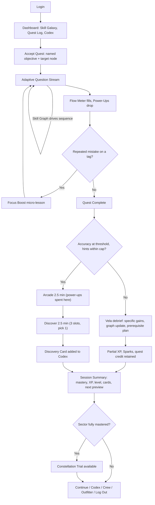

# QuestBreak Student Branch — Product Plan v2.0

**Hybrid Reward Adaptive Learning App for Middle Schoolers**

Supersedes: Plan Version 1.0 — QuestBreak Student Branch. Section numbering mirrors v1.0 so the two documents can be read side by side. Sections marked **NEW** did not exist in v1.0.

---

## 0. What v2.0 Changes

v1.0 was academically sound and motivationally thin. It had exactly one reward (the 5-minute Hybrid Break), one progression signal (the Skill Galaxy), and one habit hook (a streak counter). Nothing structurally connected *how well a student learned* to *how good the reward felt*, which means the arcade half read as a bribe rather than a payoff.

v2.0 adds a game layer. It does not touch the academic engine.

| Area | v1.0 | v2.0 |
|---|---|---|
| Round framing | "20-minute round" | Named **Quest** with a story objective and a Quest Log |
| Progression | Skill Galaxy + streak | Skill Galaxy + **XP, Learner Levels, Sparks currency** |
| Enrichment payoff | Optional bookmarks | **Discovery Cards** in a collectible **Codex** with themed sets |
| In-round feedback | Accuracy tally | **Flow Meter** combo multiplier + **Power-Up drops** |
| Arcade half | Standalone mini-games | Mini-games **powered by power-ups earned while learning** |
| Skill Galaxy | Visual graph | Narrative **star map** with sectors, a companion, and boss **Constellation Trials** |
| Social | None | Opt-in **Crews**, effort-ranked leaderboards, async **Duels** |
| Domain completion | Nothing special | **Constellation Trial** boss encounter |
| Failure handling | "Encouragement" screen | Explicit anti-frustration system with grace days and no loss aversion |

### 0.1 Preserved v1.0 Guarantees

These are load-bearing and must not be traded away for engagement:

1. **Mastery Before Play.** The Hybrid Break unlocks at the accuracy threshold (default 85%) with a hint cap. No game system may bypass this gate — power-ups, Sparks, level, and Crew standing cannot buy a break.
2. **The theme is the wrapper, never the simplifier.** Academic vocabulary and cognitive demand stay constant across Sports, Gaming, Music, Animals, and Space. This now applies to every new surface too: quest titles, card text, and companion dialogue may be playful, but question stems keep full rigor.
3. **Enrichment is ungraded.** No scores, no penalties, no correctness gating in the Discover phase. Discovery Cards are awarded for *participating*, never for being right.
4. **Adaptive, not prescriptive.** The Skill Graph still drives sequencing. The narrative map is a *rendering* of the graph, not a replacement for it — story never dictates which skill comes next.
5. **The 20-minute learn / 5-minute break ratio holds.** The break is still 2.5 minutes arcade + 2.5 minutes enrichment.

### 0.2 The One-Sentence Design Thesis

> Learning well should visibly make the fun part better — not merely unlock it.

Every system below is judged against that sentence. Power-up carryover (§5.2) is the clearest expression of it and is the mechanic other systems depend on.

---

## 1. Core Design Principles (revised)

| Principle | Implementation |
|---|---|
| Agency | Students pick interests and themes; they also name their companion, choose one enrichment slot, and pick their own cosmetics |
| Rigor | Same standards, different context. A linear equation is a linear equation whether it models a rocket trajectory or a sports stat |
| Mastery Before Play | Accuracy threshold (default 85%) required to unlock the Hybrid Break |
| Adaptive, Not Prescriptive | Skill Graph identifies granular competencies, not a single "grade level" |
| Balanced Rewards | Half arcade (motivation), half enrichment (depth) |
| **Earned Advantage** (NEW) | Learning performance converts into concrete arcade advantages, so effort is felt inside the fun |
| **Progress Is Never Lost** (NEW) | XP, cards, and levels are monotonic. Streaks have grace days. Nothing is taken away as punishment |
| **Compete on Effort, Not Ability** (NEW) | Any social comparison ranks focus, persistence, and curiosity — never raw accuracy |

---

## 2. Quest Framing (NEW)

### 2.1 From "Round" to "Quest"

A 20-minute round is presented as a **Quest** with a name, a one-line story objective, and a target skill node. The framing is cosmetic to the adaptive engine and material to the student.

**Objective card shown before starting:**

```
QUEST: Recalibrate the Ratio Array
SECTOR: Number Sense · Kepler Station
GOAL: Ratio Reasoning — hold 85% to bring the array online
VELA: "Array's drifting. If we get the ratios right, the whole
station comes back on line. No pressure. Some pressure."
```

Quest names are generated from a template bank keyed by `skill_node_id` × `theme`, so the same Ratio Reasoning quest is "Recalibrate the Ratio Array" for a Space student and "Rebuild the Crafting Line" for a Gaming student.

### 2.2 Quest Log

The Quest Log holds **3 dailies + 1 weekly**. Every objective is defined in terms of learning behavior, never time-on-app, so the log cannot be farmed by idling.

**Daily pool (3 drawn per day):**

- Complete a quest with 0 hints used
- Resolve 1 repeated-mistake tag
- Reach a Flow Meter tier of 5 or higher
- Master a new skill node
- Bookmark a discovery from an unfamiliar theme
- Complete a quest in a theme you have not used this week
- Finish the Discover phase without skipping

**Weekly pool (1 drawn per week):**

- Resolve 3 repeated-mistake tags
- Master 2 nodes in the same sector
- Complete 4 quests
- Collect 3 Discovery Cards from one set
- Attempt a Constellation Trial

**Rewards:** dailies grant 40–75 XP and 15–25 Sparks. The weekly grants 200 XP, 60 Sparks, and one guaranteed Uncommon-or-better Discovery Card.

### 2.3 Anti-Farming Rules

- Objectives requiring mastery or mistake-resolution are verified against the Skill Graph, not self-reported.
- A quest counts as "completed" only if the student answered the full question set; abandoning at question 3 does not count.
- Dailies do not stack across days. Unclaimed dailies expire, but expiry is silent — no "you missed it" messaging (see §10.1).

---

## 3. Progression Economy (NEW)

### 3.1 XP

XP is awarded per answer and per milestone. The curve deliberately rewards *first-try correctness and independence* while never punishing hint use into worthlessness, because v1.0 treats hints as a diagnostic signal rather than cheating.

| Event | XP |
|---|---|
| Correct, first try, no hint | 10 |
| Correct, first try, 1 hint | 6 |
| Correct, first try, 2+ hints | 4 |
| Correct after an incorrect attempt | 5 |
| Incorrect, attempted, reviewed explanation | 2 |
| Deliberate-pace bonus | +3 |
| New node reaches Mastered | +50 |
| Repeated-mistake tag resolved | +40 |
| Quest completed | +75 |
| Constellation Trial cleared | +250 |

**Deliberate-pace bonus** pays out when time-on-question falls inside the student's own rolling band (between 60% and 250% of their personal median for that difficulty tier). It is intentionally *not* a speed bonus: v1.0 §3.1 already flags rushing as a risk signal, so rewarding raw speed would fight the adaptive engine. Answering suspiciously fast earns no bonus even when correct.

Note that even an incorrect answer earns 2 XP for engaging with the explanation. Trying and being wrong must never be worth zero.

### 3.2 Flow Multiplier Applied to XP

Base XP for answers is multiplied by the current Flow tier (§5.1). Milestone XP (mastery, quest, trial) is never multiplied, so the multiplier cannot dominate the economy.

### 3.3 Learner Levels

| Level | Cumulative XP | Unlock |
|---|---|---|
| 1 | 0 | Interest selection, Nova Runner, Trivia + Real-World enrichment |
| 2 | 150 | Outfitter opens (avatar gear) |
| 3 | 400 | Beat Match arcade; Creative Prompt enrichment |
| 4 | 750 | Crews (opt-in, guardian-gated) |
| 5 | 1,200 | Codex frames; second interest theme slot |
| 6 | 1,800 | Stat Slam arcade; Puzzle/Logic enrichment |
| 7 | 2,550 | Duels (opt-in) |
| 8 | 3,450 | Craft Chain arcade; Maker Moment enrichment |
| 9 | 4,500 | Companion customization (voice + look) |
| 10 | 5,700 | Habitat Rescue arcade; Expedition long-form enrichment |
| 11+ | +1,500 per level | Cosmetic tiers, Codex auras, arcade skins |

A typical engaged student earns 350–600 XP per session, so early levels arrive roughly every session and later ones every two to three. Content unlocks front-load in the first ten levels; past level 10 rewards are cosmetic only, so a late-joining student is never at a functional disadvantage.

### 3.4 Sparks

**Sparks** are the soft currency. Earn rate is roughly 1 Spark per 10 XP, plus quest and set bonuses. Sparks are spent in the **Outfitter** on:

- Avatar gear (theme-flavored: astronaut helmet, jersey, headphones, ranger kit, crafting cloak)
- Arcade skins (visual reskins only — never stat changes)
- Codex frames and card backs
- Companion accessories

**Hard rules:** Sparks cannot be purchased with money, cannot be gifted or traded (removes coercion between students), cannot buy hints, and cannot buy break access. Everything they buy is cosmetic. Nothing in the Outfitter confers an academic or arcade advantage.

---

## 4. Discovery Codex (NEW — replaces v1.0 bookmarks)

### 4.1 From Bookmark to Card

v1.0 let students bookmark enrichment discoveries into a library. Nobody returns to a bookmark folder. v2.0 makes each discovery a **Discovery Card** — a collectible object with art, a title, the enrichment content on the back, and a "go deeper" pointer.

One card is awarded per completed Discover phase, unconditionally on participation. Ungraded means ungraded: a student who reads the wolf-pack article and answers the reflection question "I don't know yet" still earns the card.

### 4.2 Sets

Cards belong to **sets of 8**, one set per theme plus a cross-theme set:

- **Deep Space** (Space)
- **Apex Predators** (Animals)
- **Rhythm & Roots** (Music)
- **Build Order** (Gaming)
- **Margins & Miracles** (Sports)
- **Anomalies** (cross-theme, rarest — awarded for enrichment completed in an unfamiliar theme, which is the reward hook that fixes theme fatigue)

Rarities: Common, Uncommon, Rare, Luminous. Each set contains 5 Common/Uncommon, 2 Rare, 1 Luminous. Luminous cards are only obtainable from Constellation Trials and weekly quests, so the last card in a set requires academic progress rather than repetition.

### 4.3 Set Completion Rewards

Completing a set grants a **title** (displayed under the avatar), an **avatar aura**, and unlocks an **Expedition** — a multi-chapter long-form enrichment on that theme, consumed 2.5 minutes at a time across future breaks. This gives long-term collectors an escalating reward rather than a dead end.

Duplicate cards convert to 5 Sparks. The Codex shows silhouettes of uncollected cards so students can see what they are chasing, but silhouettes never reveal content, and there is no "complete the set now" purchase path.

### 4.4 The Studio

Creative Prompt enrichment outputs (drawings, designs, short writing) are saved to a personal **Studio** alongside the card that generated them. This is a private space by default. Sharing to a Crew is opt-in, requires guardian consent, and passes through moderation (§7.4).

---

## 5. In-Round Game Feel (NEW)

### 5.1 The Flow Meter

A visible meter that fills with consecutive correct answers and multiplies base XP.

| Consecutive correct | Flow tier | XP multiplier |
|---|---|---|
| 0–2 | Warming | 1.00× |
| 3–4 | Locked In | 1.25× |
| 5–7 | In Flow | 1.50× |
| 8–11 | Deep Flow | 1.75× |
| 12+ | Luminous | 2.00× |

**Decay, not collapse.** An incorrect answer drops the meter *one tier*, never to zero. A twelve-answer run followed by one mistake lands at Deep Flow, not Warming. This is the single most important tuning decision in the section: reset-to-zero combo systems teach students that one mistake ruins everything, which is precisely the belief a remediation-friendly product must avoid.

**Hints do not break Flow.** Hint use is already priced into base XP (§3.1); charging it twice would push students to guess rather than ask for help, corrupting v1.0's hint-usage telemetry.

### 5.2 Power-Ups: Learning Powers the Arcade

Power-ups drop during the learning phase and are **spent in the arcade half of the Hybrid Break**. This is the mechanic that converts academic effort into felt advantage.

| Drop trigger | Power-Up | Arcade effect |
|---|---|---|
| Reach Flow tier 3 (Locked In) | **Shield** | Absorb one hit / one miss |
| 5 consecutive correct with no hints | **Overdrive** | 2× score for 20 seconds |
| First-try correct on a node marked Developing | **Extra Life** | One additional run attempt |
| Resolve a repeated-mistake tag | **Nova Core** (Rare) | Widened timing windows + 3× score for 15 seconds |
| Clear a Focus Boost micro-lesson | **Steady Hand** | Slows the game 15% for 20 seconds |

**Carry rules:** maximum 4 power-ups per break. Unused power-ups do not carry to the next session — instead they convert to 10 Sparks each, so nothing is wasted and no student can stockpile ten Nova Cores to trivialize the arcade. Power-ups are strictly arcade-side; they can never be used on academic questions.

**Why the cap matters:** without expiry, the optimal strategy becomes hoarding, which decouples this session's learning from this session's fun and breaks the design thesis in §0.2.

### 5.3 Focus Boost (reframed from v1.0 "Focus Mode")

v1.0 triggered "Focus Mode" — a 3-question micro-lesson — after repeated mistakes on the same tag. The mechanic is good; the framing reads as a penalty box. v2.0 renames it **Focus Boost**, presents it as an opportunity ("Vela: this one keeps slipping — 90 seconds and we own it"), and attaches a power-up reward (Steady Hand) for completing it. Same pedagogy, inverted emotional valence.

### 5.4 Moment-to-Moment Polish

- **Answer feedback:** correct answers land with a short particle burst and a rising tone; the tone pitch climbs with Flow tier, so the student *hears* their streak.
- **Near-miss acknowledgment:** on a wrong answer, the companion names what was close ("Your setup was right — the ratio just flipped") rather than a generic "Incorrect."
- **Avatar reactions:** the avatar idles, reacts to Flow tier changes, and celebrates mastery.
- **Mastery moment:** when a node flips to Mastered, the corresponding star on the map ignites in a full-screen beat. This is the primary celebration of the product and should be the most polished animation in the app.
- **Reduced-motion mode** substitutes crossfades and static states for every effect above, with no loss of information.

---

## 6. Narrative Layer: The Skill Galaxy as a Map (NEW)

### 6.1 Structure

v1.0's Skill Galaxy visualized mastered, developing, and locked nodes. v2.0 keeps that data model exactly and gives it a place.

- Each Skill Graph **domain** becomes a **sector** with a name and a look (Number Sense → Kepler Station; Algebra → The Lattice; Geometry → Meridian Belt; Data & Statistics → The Observatory; and parallel sectors for Reading).
- Each **micro-competency** is a **star**. Mastered stars glow, Developing stars pulse, locked stars are dim outlines.
- **Prerequisite edges** render as flight paths, so a student can see that Slope-Intercept Form sits downstream of Linear Expressions.

The map is a view of the graph. Narrative never reorders instruction: if the adaptive engine routes to a prerequisite node, the story accommodates it.

### 6.2 Vela, the Companion

A navigation AI, present in a corner of the screen, with a small dialogue vocabulary and a consistent voice: warm, plain-spoken, never saccharine, never sarcastic about mistakes. Students may rename her at level 9 and customize her look.

Voice samples that define the register:

- On a wrong answer: *"Close. Your setup was right — the ratio just flipped. Try it the other way."*
- On a hint request: *"Good call asking. Here's the piece you need."*
- On below-threshold rounds: *"We didn't clear the gate. But I logged three things you got sharper at. Tomorrow we take it from prerequisites."*
- On mastery: *"That star's ours. Number Sense is one node from lighting up completely."*
- On return after absence: *"You're back. Picking up where we left off — nothing lost."*

Explicitly out of register: guilt ("you haven't practiced in 3 days"), urgency ("your streak dies in 2 hours"), and false enthusiasm for low-effort actions.

### 6.3 Constellation Trials

When every node in a sector reaches Mastered, that sector's **Constellation Trial** unlocks — the product's boss encounter.

**Structure:** 5 questions drawn from across the sector at the top difficulty tier, in the student's theme, followed immediately by a themed arcade finale where power-ups earned during the trial apply.

**Stakes, carefully bounded:**

- Passing requires 4 of 5. Two attempts per session.
- Failing costs nothing. Mastery states do not regress, no XP is lost, and the Trial simply remains available. Vela: *"The constellation's not going anywhere."*
- Rewards: the sector lights permanently on the map, a sector badge, 250 XP, 100 Sparks, and a guaranteed **Luminous** Discovery Card.

Trials are the only place where a genuinely hard, high-ceremony academic challenge exists, which is what makes them feel like an event. They must never be required to progress — a student who never attempts one still advances through the graph normally.

---

## 7. Social Layer (NEW — opt-in, low-stakes)

All social features are **off by default**, require guardian consent, unlock at level 4 or above, and are fully usable-by-omission: a student who never opts in loses no content, XP, or cards.

### 7.1 Crews

Groups of 4–6 with a shared weekly goal drawn from effort metrics:

- Collect 600 combined focus minutes
- Resolve 15 combined repeated-mistake tags
- Collect 12 combined Discovery Cards
- Complete 20 combined quests

Completing a crew goal grants every member Sparks and a crew banner. **Crew goals are additive, never competitive between members**, and individual accuracy is never visible to peers — a crewmate sees your focus minutes and cards, not your scores. A student having a hard week cannot let the crew down in a visible way, because the goal is a sum and shortfalls are shown as a crew total, not a per-member breakdown.

### 7.2 Leaderboards Ranked on Effort

Weekly, opt-in, and deliberately measuring things a struggling student can win:

- **Focus Minutes** — time in deliberate practice
- **Mistakes Resolved** — repeated-mistake tags cleared
- **Cards Collected** — curiosity
- **Explorer** — distinct themes engaged

Raw accuracy is never ranked. Only the top 3 are named; everyone else sees a band ("top half," "climbing") rather than an absolute position, so there is no last place. Boards reset weekly, and no reward depends on placing.

### 7.3 Duels

Async and friendly. Two students answer the same 5 questions from the same seed, then watch a **ghost replay** of the other's run. There is no rating, no ladder, and both participants earn Sparks. A duel is a shared experience with a scoreboard attached, not a ranked mode — a rated system would punish the students who most need practice.

### 7.4 Communication Constraints

There is no free-text chat between students. Interaction is limited to a fixed set of preset emotes and reactions, and any Studio work shared to a Crew passes through automated moderation plus a report path. This is a deliberate ceiling on social features: for a middle-school product, the risk of open messaging outweighs its engagement value.

---

## 8. The Hybrid Break (expanded from v1.0 §5)

### 8.1 Unlock Criteria (unchanged in substance)

- Complete a quest (full question set)
- Achieve the accuracy threshold — default 85%, per-student adjustable (§11.1)
- No more than 3 hints used, adjustable per student profile

No game-layer currency, level, or social standing can substitute for these.

### 8.2 Phase 1 — Arcade, 2.5 minutes ("Recharge")

Five skill-based mini-games, each theme-skinnable, each consuming power-ups earned during the quest. The student's theme selects a default; any unlocked game can be chosen manually.

| Game | Native theme | Core skill | Power-up interaction |
|---|---|---|---|
| **Nova Runner** | Space | Reaction + route reading | Shield absorbs a collision; Extra Life restarts a run |
| **Beat Match** | Music | Rhythm precision | Overdrive doubles combo scoring; Steady Hand widens windows |
| **Stat Slam** | Sports | Timing + arc estimation | Nova Core triples scoring during a hot streak |
| **Craft Chain** | Gaming | Pattern matching + planning | Steady Hand slows the descent; Shield clears one jam |
| **Habitat Rescue** | Animals | Pathfinding + spatial logic | Extra Life retries a failed route; Overdrive doubles rescues |

Per v1.0, these are skill-based, not mindless tapping. **Timing rule:** at 2:30 the game stops accepting new runs but lets an in-progress run finish (up to 20 seconds of grace). Cutting a student off mid-run to enforce a timer trades a small scheduling win for a real frustration cost.

### 8.3 Phase 2 — Educational Enrichment, 2.5 minutes ("Discover")

Ungraded, unpenalized, interest-connected. Formats:

1. **Trivia Challenge** — 3 questions on the interest theme
2. **Real-World Connection** — short article or clip + 1 reflection question
3. **Creative Prompt** — open-ended design or writing task, saved to the Studio
4. **Puzzle / Logic** — visual patterns, light cryptography, logic grids
5. **Maker Moment** — step-by-step drawing, a code snippet, or a music-theory mini-lesson
6. **Expedition** (NEW, unlocked by completing a Codex set) — a multi-chapter long-form exploration consumed one chapter per break

Each completed segment awards one Discovery Card.

### 8.4 Enrichment Selection: Resolving v1.0 Open Question 3

v1.0 asked whether enrichment should be student-choice or algorithm-picked. It is both, in a fixed ratio. The student is shown **three options and picks one**:

- **Slot A — gap-adjacent (algorithm).** Content whose background knowledge touches a skill node the student is currently developing. Not a disguised drill; a Space student struggling with ratios might get a card on how engineers scale rocket fuel mixtures.
- **Slot B — set-completion (algorithm).** Content that yields a card the student is missing from an incomplete set, biased toward the **Anomalies** set when the student has been in one theme for more than five sessions. This is the theme-fatigue solution: novelty is *pulled* by collection desire rather than *pushed* by the system.
- **Slot C — free choice (student).** Any unlocked format, any theme, no algorithmic input. Pure agency, always present.

If the student declines to choose within 15 seconds, Slot A runs automatically so the timer is never spent deliberating.

---

## 9. Student Experience Flow (revised from v1.0 §6)



### 9.1 The Below-Threshold Path Matters Most

v1.0 sent students who missed 85% to an "Encouragement + Skill Graph Update" screen. That is the highest-risk moment in the entire product — it is where students quit. v2.0 specifies it concretely:

- **Partial rewards are real.** All XP earned during the round is kept, Sparks are kept, and quest progress is credited. Missing the gate costs the break, not the session's worth.
- **Specificity over comfort.** The debrief names 2–3 concrete things that improved ("your ratio setups went from 2 of 6 to 5 of 7") rather than "nice try."
- **A concrete tomorrow.** The student sees exactly what the next session will do: which prerequisite nodes it pulls from and in which theme.
- **One Discovery Card is still awarded** for finishing the full question set. Curiosity rewards are never gated on accuracy — only the arcade is.
- **The metric to watch** is Return-After-Miss Rate (§10). If students who miss the gate do not come back, this section is wrong regardless of what other numbers say.

---

## 10. Student Dashboard (revised from v1.0 §7)

### 10.1 Main View

- **Skill Galaxy** — the sector map (§6.1) with glowing, pulsing, and dim stars, plus prerequisite flight paths
- **Avatar** — theme gear purchased with Sparks, plus titles and auras from Codex sets
- **Vela panel** — today's line, quest suggestion
- **Quest Log** — 3 dailies + 1 weekly with progress bars
- **Discovery Codex** — sets, silhouettes of missing cards, set-completion progress
- **Focus Streak** — days of deliberate practice (not logins), with **one grace day per week applied automatically and silently**. There is no "your streak is at risk" notification and no streak-loss modal.
- **Crew panel** (if opted in) — shared weekly goal progress as a crew total
- **Outfitter** — Sparks spending
- **Studio** — saved Creative Prompt work

### 10.2 Post-Session Summary

- Accuracy with **specific** feedback, per v1.0: "You mastered Ratio Reasoning," not "Good job"
- XP earned, broken out by source (answers, Flow multiplier, milestones), plus level progress
- Sparks earned and any new Discovery Card, presented as a card reveal
- Time breakdown: focused work vs. hint time
- Skill Graph delta: which stars changed state this session
- Power-up ledger: earned, spent in the arcade, converted to Sparks
- Next session preview: "Tomorrow you'll explore slope-intercept form through [your theme]"
- **A healthy stopping point.** If the student has completed two or more quests, the summary's primary action becomes "Good place to stop" with "One more quest" as the secondary. The product should not be optimized for maximum session length.

---

## 11. Adjustable Thresholds and Accessibility

### 11.1 Per-Student Mastery Threshold — Resolving v1.0 Open Question 1

Yes, the threshold is adjustable, with constraints:

- Default 85%. Adjustable range 70–95%.
- Adjustable only by an educator or guardian through the teacher/parent branch, never by the student, and never automatically by the engine.
- The threshold is **invisible as a comparison**: the student sees "your goal," never "the normal goal is higher."
- Hint caps scale with it (a 75% threshold pairs with a 5-hint cap).
- Rewards are identical at every threshold. A student at 75% earns the same XP, cards, and arcade time as a student at 85%. Any other choice turns an accommodation into a visible penalty.
- Because thresholds differ between students, **no leaderboard or crew metric may reference the threshold or accuracy** — which is independently why §7.2 ranks effort.

### 11.2 Accessibility

- Reduced-motion mode across all celebrations, the galaxy map, and the arcade
- Dyslexia-friendly font toggle; adjustable text size and line spacing
- Colorblind-safe node states (shape and animation differentiate mastered/developing/locked, not color alone)
- Full keyboard playability for every arcade game; no game requires precise dragging
- Screen-reader labels for the Skill Galaxy, expressed as text ("Ratio Reasoning: mastered; unlocks Slope-Intercept Form")
- Captions and transcripts for all Real-World Connection media
- Arcade games offer an assist mode (slower speed) that does not reduce rewards

---

## 12. Anti-Frustration and Ethics Guardrails (NEW)

This product's users are children, and its engagement systems are therefore constrained beyond what a consumer game would accept.

**Prohibited by design:**

- **No loss aversion.** Nothing earned is ever removed. No expiring streaks with warnings, no decaying XP, no seasonal resets that wipe progress.
- **No punishing timers.** The 20 minutes is a budget, not a countdown to failure; the arcade never cuts a run short (§8.2).
- **No pay-to-win, no real-money purchases, no ads, no third-party ad tracking.**
- **No trading or gifting** between students, which removes a coercion vector.
- **No public accuracy comparison** anywhere in the product.
- **No guilt or urgency messaging.** Notifications are capped at one per day, never sent after 8 p.m. local time, and never reference streaks at risk or peers' progress.
- **No infinite scroll or autoplay** in enrichment content.
- **No dark-pattern retention loops** — specifically no daily-login-only rewards, no "one more to unlock" cliffhangers on session exit, and no variable-ratio reward schedules tuned for compulsion. Card rarity exists to make collecting legible, not to create gambling dynamics: rarity is deterministic per source (Luminous cards come only from Trials and weekly quests), and there are no random packs, no lootboxes, and no purchasable pulls.
- **Focus Boost is never framed as punishment** (§5.3).

**Required by design:**

- Partial credit for effort on every path, including failure (§9.1)
- A visible healthy stopping point (§10.2)
- Guardian consent for all social features, with a full opt-out that costs no content
- COPPA/FERPA-aligned data handling; telemetry serves pedagogy, not ad targeting
- Any A/B test affecting rewards or difficulty must be reviewed for impact on struggling students specifically, not just aggregate engagement

---

## 13. Technical Architecture (additions to v1.0 §8)

v1.0's stack stands: React or Vue front end, Phaser.js or PixiJS for arcade games, a Node.js/Python adaptive-engine microservice, a tagged themed question bank, and per-session telemetry. v2.0 adds:

- **Progression service** — XP, levels, Sparks, unlocks. Must be authoritative server-side; a client-authoritative economy invites tampering that would undermine the mastery gate's credibility.
- **Quest service** — daily/weekly generation, objective verification against Skill Graph events.
- **Card/Codex service** — set definitions, award rules, rarity sourcing, Studio storage.
- **Crew service** — membership, aggregate weekly goals, moderation queue, consent state.
- **Local-first session state** — resolving v1.0 Open Question 4 (offline). A quest, its questions, and the arcade run cache locally; results queue and sync on reconnect. Enrichment media prefetches one segment ahead. Cards and XP earned offline are provisional client-side and confirmed on sync. Constellation Trials, Duels, and Crew updates require connectivity.
- **Content pipeline** — quest-name templates keyed by node × theme, and a card authoring format with rarity, set, theme, and source constraints.

### 13.1 Data Model Additions

v1.0 collections (`students`, `skill_nodes`, `questions`, `sessions`, `mini_games`, `enrichment`) are unchanged. New:

```
progression: { student_id, xp, level, sparks, flow_best, unlocks[] }
quests: { id, student_id, type, objective, target, progress, reward, expires_at }
cards: { id, set_id, theme, title, content, rarity, source }
card_owned: { student_id, card_id, earned_at, session_id }
sets: { id, theme, card_ids[], completion_reward }
crews: { id, members[], weekly_goal, progress, reward, consent_state }
powerups: { id, type, effect, session_earned, game_consumed, sparks_converted }
trials: { id, sector_id, question_pool[], attempts, cleared_at }
studio: { id, student_id, prompt_id, artifact, shared }
```

`students` gains `mastery_threshold`, `hint_cap`, `companion_name`, `social_opt_in`, and `accessibility_prefs`.

---

## 14. Implementation Phases (revised from v1.0 §9)

Phases 1–4 preserve v1.0's 16-week plan with game-layer work folded in where it is cheap to build alongside the underlying system.

**Phase 1 — Foundation (Weeks 1–4)**
- Skill Graph data structure + adaptive routing algorithm
- Themed question bank (Math 200, Reading 200)
- Student login + interest selection
- *Added:* XP/Sparks schema and progression service skeleton; quest-name template bank

**Phase 2 — Core Loop (Weeks 5–8)**
- 20-minute session UI, real-time accuracy/hint tracking
- Post-session summary + Skill Graph visualization
- *Added:* Quest framing and objective cards; Flow Meter; power-up drop logic; Focus Boost reframing; the below-threshold debrief path (§9.1) built as a first-class screen, not a fallback

**Phase 3 — Hybrid Break (Weeks 9–12)**
- Two arcade mini-games; unlock logic + break timer
- Enrichment library (30 items across 5 themes)
- *Added:* Power-up consumption in arcade; Discovery Cards and Codex v1 with two sets; three-slot enrichment selection

**Phase 4 — Progression & Polish (Weeks 13–16)**
- Three more mini-games; enrichment expanded past 100 items
- Student testing + adaptive algorithm iteration
- *Added:* Learner Levels and unlock ladder; Outfitter; Skill Galaxy sector map with Vela dialogue; accessibility pass; game-feel pass

**Phase 5 — Trials & Social (Weeks 17–20)** *(new)*
- Constellation Trials for all sectors
- Crews, effort leaderboards, moderation queue, guardian consent flows
- Remaining Codex sets, set-completion rewards

**Phase 6 — Depth & Offline (Weeks 21–24)** *(new)*
- Expeditions (long-form enrichment)
- Duels
- Local-first offline mode and sync
- Companion customization; Studio sharing

Phases 5 and 6 are deliberately after student testing, because the social and boss systems should be tuned against observed behavior in the core loop rather than designed blind.

---

## 15. Success Metrics (revised from v1.0 §10)

Retained from v1.0:

| Metric | Target |
|---|---|
| Session Completion Rate | > 80% |
| Accuracy Threshold Hit Rate | > 60% |
| Avg. Hints per Session | Declining over time |
| Repeated Mistake Resolution | > 70% resolved within 2 sessions |
| Enrichment Bookmark Rate (now Card Award Rate) | > 40% of breaks |
| Student Retention (7-day) | > 50% |

Added for v2.0:

| Metric | Target | Why |
|---|---|---|
| **Return-After-Miss Rate** | > 65% return within 2 days | The single most important number in the document. Measures whether missing the gate demoralizes students |
| Quest Completion Rate | > 70% of accepted quests | Whether quest framing actually motivates |
| Daily Quest Claim Rate | > 50% | Whether Quest Log objectives are legible and achievable |
| Power-Up Utilization | > 80% of earned power-ups spent | If low, the arcade link is not landing |
| Card Set Completion | > 25% of students complete 1 set in 8 weeks | Whether long-term collection works |
| Anomalies Set Engagement | > 30% of students earn 1+ Anomaly card | Whether the theme-fatigue solution works |
| Crew Participation (of eligible) | > 40% | Social value without coercion |
| Constellation Trial Attempt Rate | > 50% of unlocked trials attempted | Whether the boss reads as inviting rather than intimidating |
| Trial Retry Rate After Failure | > 60% | Whether failure is genuinely low-stakes |
| Student Retention (30-day) | > 35% | Long-arc value of the progression layer |

**Guardrail metrics** — watched to make sure engagement is not bought with harm. Any of these tripping is a design failure regardless of headline numbers:

- Median session length should stay near 25–50 minutes; a rising tail indicates compulsion rather than value
- Rushing rate (answers below 60% of personal median) must not rise as Flow rewards are tuned
- Hint use must not fall while accuracy also falls — that pattern means students are guessing to protect Flow
- Below-threshold students' XP-per-session must remain within 60% of above-threshold students'

---

## 16. Open Questions

### 16.1 Resolved from v1.0

1. **Adjustable 85% threshold?** Yes — 70–95%, educator-set, invisible to peers, identical rewards at every level (§11.1).
2. **Theme fatigue?** Solved by pull rather than push: the **Anomalies** card set only fills from unfamiliar themes, and enrichment Slot B biases toward it after five sessions in one theme (§4.2, §8.4). Explorer standing on leaderboards reinforces it. Students are never forced out of a theme they love.
3. **Enrichment student-choice or algorithm-picked?** Both, fixed: 2 algorithm slots (gap-adjacent, set-completion) + 1 free-choice slot, student picks one of three (§8.4).
4. **Offline mode?** Local-first quest and arcade caching with sync-on-reconnect; Trials, Duels, and Crews require connectivity (§13).
5. **Parent/teacher view?** Remains a separate branch. The student branch exposes only: mastery threshold and hint cap (read), social consent state (read), and a telemetry stream. Guardians never see Studio artifacts without the student sharing them, and the student branch never renders guardian-facing commentary.

### 16.2 New to v2.0

1. **Economy tuning source.** The XP and Spark numbers in §3 are reasoned but unvalidated. Do we tune them from Phase 2 telemetry, or run a small pilot with a deliberately generous economy first and tighten later? Tightening an economy after launch is historically the more painful direction.
2. **Power-up expiry.** Converting unused power-ups to Sparks (§5.2) prevents hoarding but may read as loss to students. Is a 1-session carryover with a hard cap of 4 a better compromise?
3. **Flow Meter and rushing.** Flow rewards consecutive correctness, which could encourage guessing on hard questions to protect the streak. Guardrail metrics in §15 will detect it, but do we need a preemptive mechanic — for example, Flow pausing rather than decaying on skipped questions?
4. **Crew composition.** Auto-assigned by similar practice volume, teacher-assigned, or friend-invite? Auto-assignment by volume avoids ability sorting but may produce inactive crews.
5. **Card content pipeline.** Eight cards per set across six sets is 48 authored cards minimum, each needing art. Human-authored, templated, or a hybrid, and who reviews for accuracy?
6. **Constellation Trial difficulty ceiling.** Top-tier questions across a whole sector may be genuinely hard. Does a failed trial need a scaffolded second form, or does that undercut the event?
7. **Level 10+ pacing.** Cosmetic-only rewards past level 10 may feel hollow for the most engaged students. Does a prestige-style path exist that adds no functional advantage?
8. **Companion voice localization.** Vela's register is central to the product's tone. How does it survive translation, and who owns the voice guide?

---

**Plan Version 2.0 — QuestBreak Student Branch**
Expands Plan Version 1.0. Academic guarantees in §0.1 are non-negotiable; all game systems in §2–§8 are tunable.
